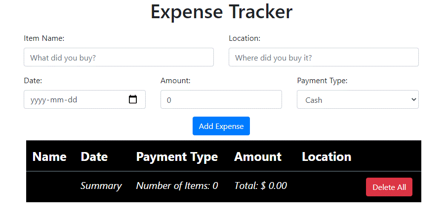
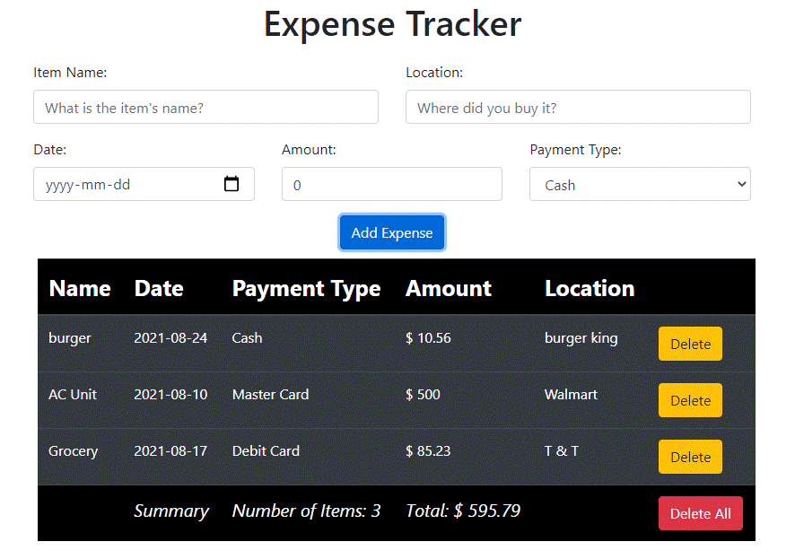

## Expense Tracker

Expense Tracker made with React and deployed to Heroku

Try it [here](https://fritz-expense-tracker.herokuapp.com/)

## Instructions

---

- Input:

  - Item Name: Name of product
  - Location: Where it was bought
  - Date: When it was bought
  - Amount: Cost of the Item
  - Payment Type: Method used to pay

- Add Expense: Saves the input into the table
- Delete: Delete individual items
- Delete ALL : Deletes all items from the table

- The last row on the table will show the number of items on your list and the total amount

## Summary

---

This is my first project using React and it was a big leap from vanilla JavaScript. This project utilizes `React Hooks` to modify state as it passes through different parts of the application. `Local storage` is used to save data with the help of `useEffect` hook. This was also my first deployment to `Heroku`, there were some challenges with the set up but it was a great learning experience. Overall I am excited to continue as I dive into more complex React hooks with my next project.

## Author

---

- **Fritz Solibio** - _Software Development Mastermind Student_
